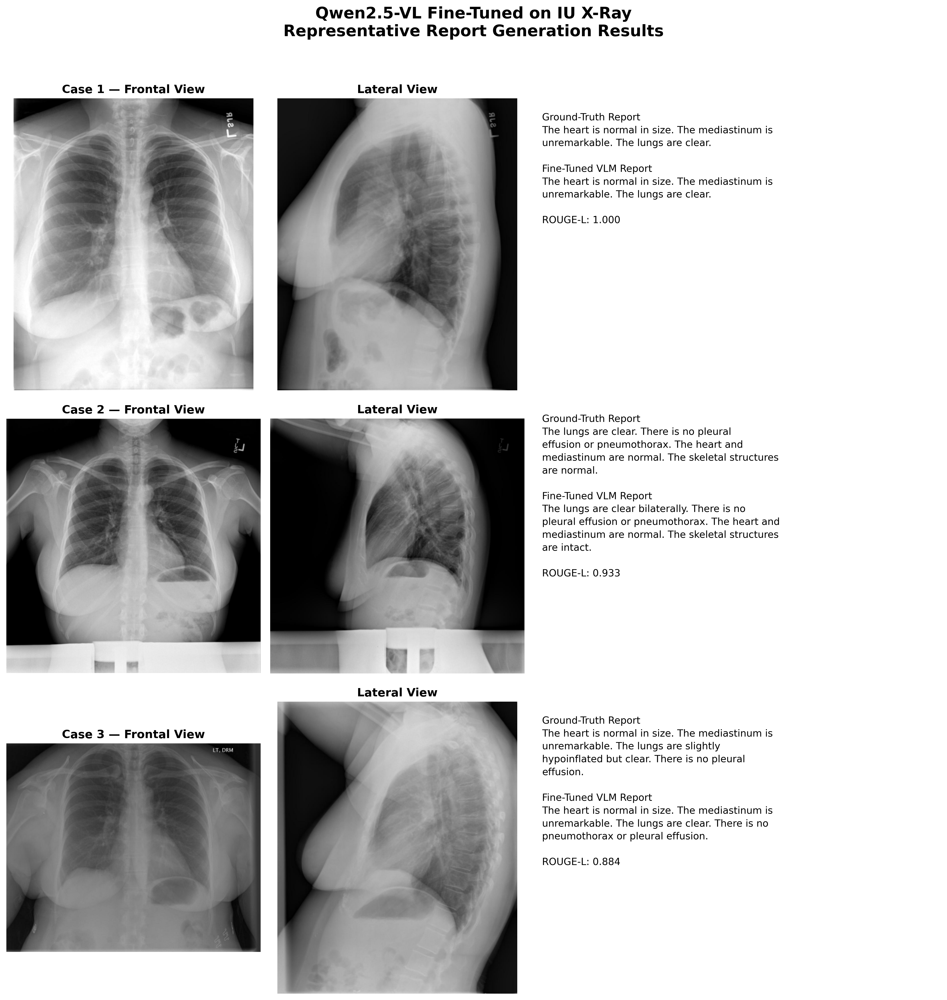

# LoRA Fine-Tuning of Qwen2.5-VL on IU X-Ray for Automated Radiology Report Generation

## Overview

This project fine-tunes **Qwen2.5-VL-3B-Instruct** using **Low-Rank Adaptation (LoRA)** for automated radiology report generation from chest X-ray studies.

The model receives **two chest X-ray views (frontal and lateral)** together with a short instruction and generates a concise radiology-style report describing the study.

The project demonstrates an end-to-end medical vision-language pipeline:

**Chest X-rays → Qwen2.5-VL → LoRA Fine-Tuning → Radiology Report Generation → Evaluation**

---

## Dataset

The experiments use the **IU X-Ray dataset**, containing paired chest X-ray images and corresponding radiology reports.

Dataset split used in this project:

| Split | Studies |
|---|---:|
| Training | 2,069 |
| Validation | 296 |
| Test | 590 |

Each study contains two chest X-ray views and a reference radiology report.

---

## Model and Fine-Tuning

- **Base Model:** Qwen2.5-VL-3B-Instruct
- **Task:** Medical image-to-text report generation
- **Fine-Tuning Method:** LoRA
- **Trainable Parameters:** 7.37M
- **Trainable Percentage:** ~0.196%
- **Training Epochs:** 1
- **Input:** Frontal + lateral chest X-rays
- **Output:** Generated radiology report

LoRA enables parameter-efficient adaptation of the large vision-language model while updating only a small fraction of its parameters.

---

## Evaluation

The fine-tuned model was evaluated on **590 held-out test studies**.

| Metric | Score |
|---|---:|
| BLEU | 0.1193 |
| ROUGE-1 | 0.4252 |
| ROUGE-2 | 0.1756 |
| ROUGE-L | 0.3163 |

These metrics measure textual similarity between the generated and reference radiology reports.

---

## Qualitative Results

The following examples compare the generated reports with the corresponding ground-truth radiology reports.

### Representative Cases

Each example contains:

- Frontal chest X-ray
- Lateral chest X-ray
- Ground-truth radiology report
- Fine-tuned VLM-generated report
- ROUGE-L similarity score

---

## Key Takeaways

- Adapted a pretrained vision-language model to the medical imaging domain using LoRA.
- Processed paired frontal and lateral chest X-rays jointly for report generation.
- Fine-tuned only ~0.196% of the model parameters.
- Evaluated the system on the complete 590-study held-out test set.
- Produced both quantitative metrics and qualitative report-generation examples.

---

## Technologies

- Python
- PyTorch
- Hugging Face Transformers
- PEFT / LoRA
- Qwen2.5-VL
- Hugging Face Datasets
- Medical Vision-Language Modeling
- BLEU and ROUGE Evaluation

---

## Important Note

This project is an experimental medical AI implementation for research and educational purposes. The generated reports are not intended for clinical diagnosis or direct patient-care decisions.
